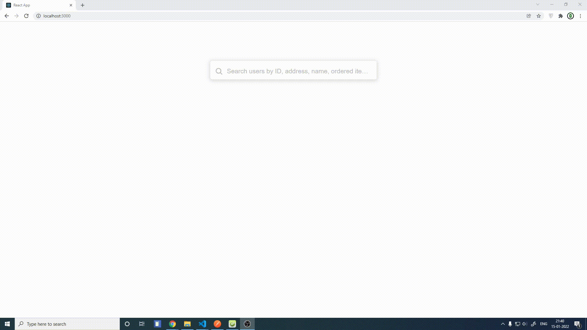

## Setup

Clone the project or Download

`npm` and `mongodb` must be installed

In `current directory(React)` and in `server directory(node)`, use below command in 2 different terminals

```bash
npm install

npm run start
```

You may want to run `init.js` file inside server to add some dummy data in DB

```bash
cd server
node init.js
```

Oh you are still reading but don't click this [Link](https://docs.google.com/document/d/1vyDKUeF8FtSweqUUDJzBP4EKD4V_Nbzo6dF7GM6CPI8?usp=sharing)!

